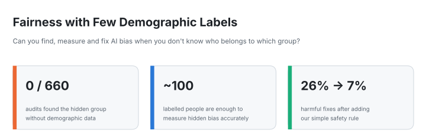
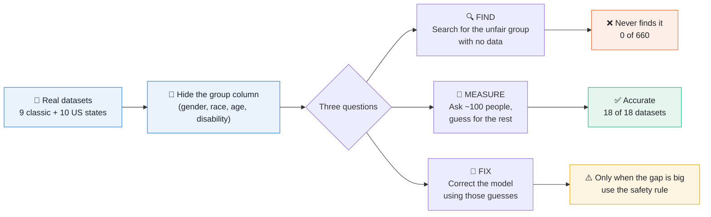
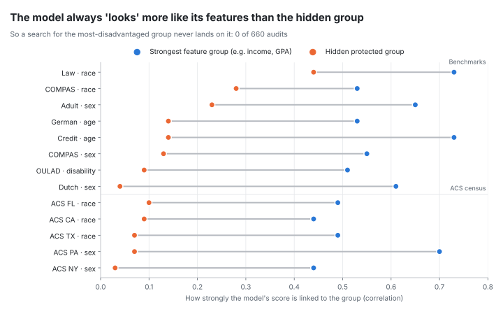
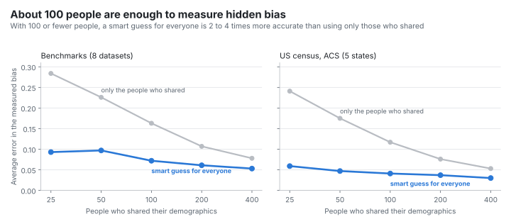
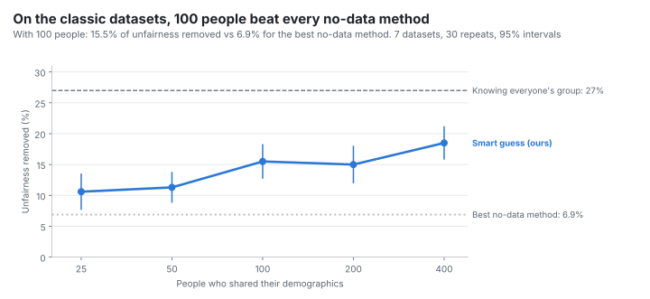
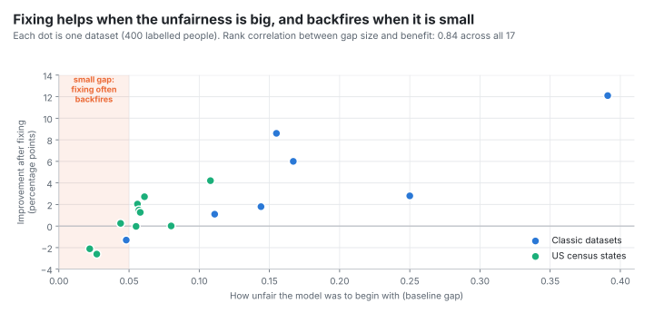
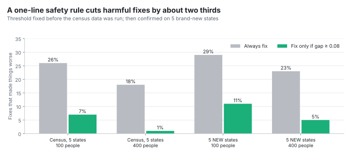
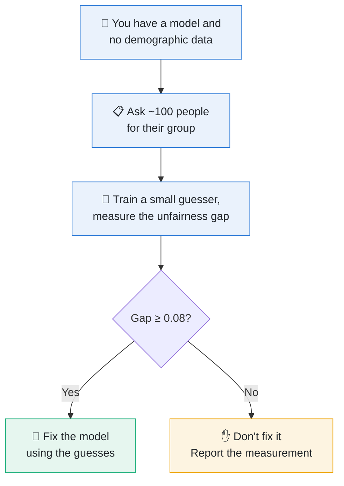

<div align="center">

<picture>
  <source media="(prefers-color-scheme: dark)" srcset="docs/figures/hero-dark.svg">
  
</picture>

<br>


**Measuring Hidden-Group Bias with Few Demographic Labels:<br>Why Demographic-Free Audits Fail and When Proxy Correction Helps**

Chirag Joshi · Soumya Shradha · Tanishk Gangwar · Vivansh Garg · Yagya Salwan<br>
Department of Computer Science and Engineering, Manipal University Jaipur

[The idea in 60 seconds](#-the-idea-in-60-seconds) ·
[Findings](#-what-we-found) ·
[How we tested](#-how-we-tested-it) ·
[What did not work](#-what-did-not-work) ·
[Try the app](#-try-it-in-your-browser) ·
[Run it yourself](#-run-it-yourself) ·
[Glossary](#-glossary)

</div>

---

## ⚡ The idea in 60 seconds

AI models help decide who gets a **loan, a job interview or bail**. Sometimes they treat one group, such as women or a racial minority, worse than others.

To check for that, you normally need to know **who belongs to which group**. But very often that information **was never collected**, is private, or people chose not to share it.

So we asked three simple questions:

| | Question | Our answer |
|:-:|---|---|
| 🔍 | **Can you *find* the unfair group without that data?** | **No.** In 660 tries, it never worked once. |
| 📏 | **Can you *measure* the unfairness with just a little data?** | **Yes.** About 100 people sharing their group is enough. |
| 🔧 | **Can you *fix* it with that little data?** | **Only if the unfairness is clearly big.** A simple safety rule prevents most bad fixes. |

> [!TIP]
> **One-line takeaway:** without demographic data you cannot *find* bias, but a small survey of about 100 people lets you *measure* it, and you should only try to *fix* it when it is clearly big.

---

## 🗺️ The project at a glance



The protected column is hidden from every model, **like an answer key**. We only look at it at the very end, to check whether each method actually worked.

---

## 📊 What we found

### 🔍 Finding 1: You cannot find the unfair group without the data

If you ask a model *"which group do you treat worst?"* without telling it about gender or race, it **always points at the things it actually uses**, such as income, test scores or past convictions. It never points at the hidden group.

> **Everyday analogy:** a teacher grades mostly on homework. If you look for the biggest difference in grades, you will find *"did homework vs did not"*, not *boys vs girls*, even if a gender gap is hiding underneath.

<picture>
  <source media="(prefers-color-scheme: dark)" srcset="docs/figures/audit-dark.svg">
  
</picture>

We also **proved mathematically** why this happens. In plain words: *a group looks unfair in proportion to how closely the model's score follows that group*. A model that never saw gender can only follow it indirectly, so its own input features always win.

| Data family | Audits run | Times the hidden group ranked first |
|---|:-:|:-:|
| Classic benchmark datasets (17 dataset-attribute pairs) | 510 | **0** |
| US census data (5 states) | 150 | **0** |
| **Total** | **660** | **0** |

<details>
<summary><b>📐 Show the math (for the curious)</b></summary>

<br>

For any score $s$, any group $G$, and a fixed true label $y$, with $\pi$ the share of the group:

$$\Delta_G \;=\; \frac{\sigma_s \, \rho_{sG}}{\sqrt{\pi(1-\pi)}}$$

where $\Delta_G$ is the gap in average score between the group and everyone else, $\sigma_s$ is the spread of the score, and $\rho_{sG}$ is how strongly the score is correlated with belonging to the group.

So the gap an audit sees is driven by the correlation. A feature the model leans on has a correlation near 0.8; for a group making up 15% of people to beat it, the model would need a correlation above 0.57 with that hidden group, which almost never happens unless the other features practically reveal it. The identity held to within $10^{-14}$ in every run.

</details>

---

### 📏 Finding 2: About 100 people are enough to measure hidden bias

You do not need everyone's gender or race. If **about 100 people** share theirs, you can train a small *"guesser"* that estimates it for everyone else, then use those guesses to measure how unfair the model is.

> **Everyday analogy:** an election poll. You don't ask the whole country, but a well-used small sample gives an accurate picture.

<picture>
  <source media="(prefers-color-scheme: dark)" srcset="docs/figures/measure-dark.svg">
  
</picture>

| People who shared | Error: only those people | Error: smart guess for everyone | How much better |
|:-:|:-:|:-:|:-:|
| 25 | 0.28 | 0.09 | **3.1×** |
| 50 | 0.23 | 0.10 | **2.3×** |
| 100 | 0.16 | 0.07 | **2.3×** |
| 400 | 0.08 | 0.05 | 1.5× |

<sub>Classic datasets, 30 repeats each. On census data the smart guess was 2.9× more accurate at 100 people, and it won on **all 18 datasets** we checked, including 5 brand-new states tested under pre-registration.</sub>

> [!NOTE]
> Looking only at the people who shared **makes the model look more unfair than it really is**, because small samples are noisy and noise always looks like a gap. The smart guess removes that illusion.

---

### 🔧 Finding 3: Only fix it when the unfairness is clearly big

On the classic datasets, fixing the model with 100 people's data **removed 15.5% of the unfairness**, more than double the best method that uses no demographic data at all.

<picture>
  <source media="(prefers-color-scheme: dark)" srcset="docs/figures/budget-dark.svg">
  
</picture>

But on census data the picture changed, and we found out why: **it depends on how unfair the model was to begin with.**

<picture>
  <source media="(prefers-color-scheme: dark)" srcset="docs/figures/gapsize-dark.svg">
  
</picture>

> **Everyday analogy:** if a scale is off by a lot, you recalibrate it. If it's off by a hair and your only tool is shaky, adjusting it can make it worse.

So we made a **one-line safety rule**: *only fix the model if the measured unfairness is at least 0.08.* We fixed that number **before** looking at the census data, then tested it again on **5 brand-new states**:

<picture>
  <source media="(prefers-color-scheme: dark)" srcset="docs/figures/guard-dark.svg">
  
</picture>



> [!WARNING]
> The safety rule is **cautious, not free**. Where fixing was already working well, it sometimes held back (Georgia went from 45% to 27% improvement). And a big gap is necessary but not always sufficient: New Jersey had a real gap that the guesses could not fix. We think avoiding harm is worth that trade.

---

## 🧪 How we tested it

<table>
<tr>
<td width="50%" valign="top">

**🙈 Hidden answer key**<br>
We used real data where we *do* know people's group, then hid that column. Models never see it; we use it only at the end to grade them.

**🔁 30 repeats of everything**<br>
Every test was rerun 30 times with different random splits, so one lucky run can't fool us.

</td>
<td width="50%" valign="top">

**📝 Predictions written first**<br>
Before the final runs we wrote down what we expected and how we'd judge it (a *pre-registration*), so we couldn't move the goalposts.

**⚖️ Fair comparisons**<br>
No method was allowed to peek at the hidden column while being tuned, and every model was judged at the same approval rate.

</td>
</tr>
</table>

### The data

| Dataset | What the model predicts | Hidden group | Rows |
|---|---|---|--:|
| 💰 Adult income | Earns over $50K | Sex (female) | 12,000 |
| ⚖️ COMPAS | No re-offence within 2 years | Race (African-American), sex | 5,278 |
| 🎓 Law School | Passes the bar exam | Race (non-white) | 12,000 |
| 💳 Credit (Taiwan) | No loan default | Age under 25 | 12,000 |
| 📚 OULAD | Passes an online course | Disability | 12,000 |
| 🇳🇱 Dutch census | High-level occupation | Sex (female) | 12,001 |
| 🏦 German credit | Good credit risk | Age under 25 | 1,000 |
| 🇺🇸 US census, round 1 | Income / employment | CA, FL, TX race · NY, PA sex | 12,000 each |
| 🇺🇸 US census, round 2 | Income / employment | WA, GA, OH race · IL, NJ sex | 12,000 each |

<sub>Bank marketing and Diabetes were also used in the audit and backfire analyses. Datasets above 12,000 rows were randomly subsampled.</sub>

### Scoreboard: what we predicted vs what happened

| | Prediction (written before running) | Result |
|:-:|---|:-:|
| H1 | 100 labelled people beat every no-data method | ✅ 14.5% vs at most 7.3% |
| H2 | 400 people get 75% of the full-knowledge result | ❌ only 68% |
| H3 | Smarter row choice is no better than random | ✅ |
| H4 | Biased sharing (one group shares less) hurts | ✅ |
| H5 | Tuning on the 100 people doesn't help | ✅ |
| H6 | A "direction check" predicts bad fixes | ❌ too weak |
| H7 | Results hold for a neural network | ➖ inconclusive |
| R1 | Smart guess measures better on 5 new states | ✅ 5 of 5 |
| R2 | Safety rule reduces bad fixes on new states | ✅ |
| R3 | Guarded fixing helps where the gap is real | ✅ +10.8% |

---

## 🚫 What did not work

We report these openly. They make the work more trustworthy, not less.

- **Popular "no demographics needed" methods** (ARL, DRO, JTT, clustering) barely reduced unfairness toward the hidden group.
- **Choosing smarter people to ask** instead of random people did not help. Random was as good or better.
- **When one group shares its data less often**, results got worse (3 to 14 points lower). Real surveys must plan for this.
- **Two of our ten written-down predictions failed**, and one neural-network check was inconclusive.
- **Our earlier approach** (Candidate Feature Auditing, versions 1 to 6) tried to find the unfair group automatically. Finding 1 explains why it could not work on real data.

---

## 🚀 Try it in your browser

The **Hidden-Group Bias Lab** reruns the study's own code for one seed at a time. Pick a dataset and a hidden group, choose how many people reveal their group, and watch the three findings happen.

| Page | What you see |
|---|---|
| 🔍 Find | Every group an auditor could form from the model's inputs, ranked by the model's gap, and where the hidden group lands |
| 📏 Measure | The true gap against the labelled-only estimate and the guesser, over 30 different sets of people |
| 🔧 Fix | The correction with the 0.08 safety rule, next to cluster reweighting and the oracle |
| 📊 30-seed results | The study's tables, rebuilt from `results/` |

Run it locally:

```bash
pip install -r app/requirements.txt
streamlit run app/streamlit_app.py
```

For seeds 0-29 the app reproduces the stored rows of `results/` exactly; `pytest -q` checks this (`tests/test_app.py`).

---

## 💻 Run it yourself

<details>
<summary><b>Setup and commands</b></summary>

<br>

```bash
git clone https://github.com/tanistheta/Bias_detection.git
cd Bias_detection
python -m venv .venv && source .venv/bin/activate     # Windows: .venv\Scripts\activate
pip install -r requirements.txt
```

| Step | Command | Time on a laptop |
|---|---|---|
| Audit ranking (Finding 1) | `python scripts/exp_audit.py 0 30 results/e1_audit.csv` | minutes |
| Main experiment (Findings 2, 3) | `python scripts/exp_main.py 0 30 results/e2_x.csv law:race,adult:sex,...` | hours |
| Census data | `python scripts/exp_main.py 0 30 results/acs_a.csv acs_CA_2018_ACSIncome:race,...` | hours, downloads data once |
| Analyse everything | `python scripts/analyze_final.py` · `python scripts/analyze_e1.py` · `python scripts/analyze_acs.py` · `python scripts/round2.py` | seconds |
| Rebuild these charts | `python scripts/make_readme_figures.py` | seconds |

Full census instructions are in [`RUN_ACS.md`](RUN_ACS.md); the frozen plan and logged deviations are in [`PREREGISTRATION.md`](PREREGISTRATION.md).

</details>

<details>
<summary><b>Repository layout</b></summary>

<br>

```text
fairlab/
├── fairlab/             core package
│   ├── data.py          dataset loaders (+ ACS census via folktables)
│   ├── learn.py         fair logistic regression, MLP, ARL
│   ├── proxy.py         choosing who to ask + the "guesser"
│   ├── baselines.py     no-demographics methods (JTT, DRO, ARL, clustering)
│   ├── analysis.py      tuning rules and statistics
│   └── metrics.py       fairness metrics
├── scripts/             one script per experiment + analysis + figures
├── app/                 the web app (Streamlit) and the summaries it shows
├── tests/               checks that the app reproduces results/
├── results/             every raw run, as CSV
├── docs/figures/        the charts in this README (light + dark)
├── PREREGISTRATION.md   predictions written before the final runs
└── RUN_ACS.md           how to run the census experiments
```

</details>

---

## 📖 Glossary

| Term | Plain meaning |
|---|---|
| **Protected attribute** | The sensitive detail we care about: gender, race, age or disability |
| **Proxy / "guesser"** | A small model that guesses that detail from the other information about a person |
| **Equalized-odds gap** | How differently the model treats two groups of *equally qualified* people. 0 means equal |
| **Demographic-free method** | A fairness method that claims to work without knowing anyone's group |
| **Oracle** | A comparison that *is* allowed to see the real group. The best case, not usable in practice |
| **Seed / repeat** | One rerun of an experiment with a different random split. We used 30 |
| **Pre-registration** | Writing down predictions and rules *before* running the final tests |
| **ACS** | American Community Survey: US census data, used as a modern benchmark |
| **Safety rule / gap guard** | Only fix the model if the measured gap is at least 0.08 |

---

## 📚 Related work

This project builds on and is compared with: Hardt et al. (2016), Hashimoto et al. (2018), Lahoti et al. (2020, ARL), Liu et al. (2021, JTT), Levy et al. (2020, DRO), Zhao et al. (2022, FairRF), **Kenfack et al. (2024, the closest prior work)**, Chen et al. (2019) and Elzayn et al. (2023) on measuring bias with guessed groups, and Ding et al. (2021) for the census benchmark. The full reference list is in the paper; [`get_references.py`](get_references.py) downloads the open-access PDFs.

<div align="center">

<br>

**Made at Manipal University Jaipur** · Questions or ideas? Open an issue.

</div>
